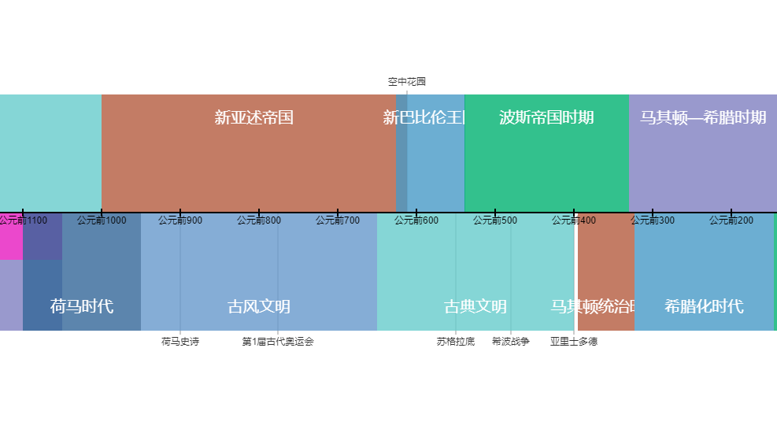

历史年表对照
===================

以对比的形式展示各个文明或维度的发展时间线。

--[Online]()--

### 参考资料：

[世界数字图书馆-世界历史时间线](https://www.wdl.org/zh/sets/world-history/timeline/#39)

[复旦大学-科技简史-科学史大事记](http://fdjpkc.fudan.edu.cn/d201413/p15844c15790/list.htm)

[Github-elvenyh-时间上的故事](https://github.com/elvenyh/yh)

[微博-麒璁韩洞-世界艺术史](https://weibo.com/2961699170/HjCzmyIEe)